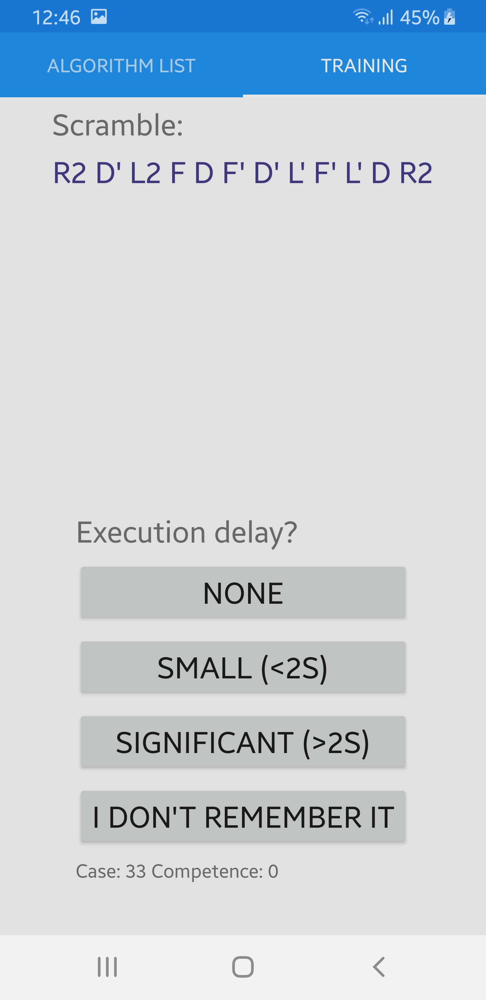

# OLL Trainer

This app was developed to be used by [speedcubers](https://en.wikipedia.org/wiki/Speedcubing) to make learning the 57 [OLL](https://www.speedsolving.com/wiki/index.php/OLL) algorithms as easy an efficient as possible.

The app combines an algorithms list such as [this one](https://www.cubeskills.com/uploads/pdf/tutorials/oll-algorithms.pdf) with a training app such as [this one](https://timothyaveni.com/cubing/oll-trainer/) to create an all-in-one package.

The app is tested and works for **UWP** and **Android** platforms (tested on Windows 10 and a Samsung Galaxy S8).

## Screenshots: UWP

 

 

## Screenshots: Android

 

 

## How to use the app

After launching the app, you will be presented with a list of OLL algorithms, which are grouped. Each case shows a diagram, case number, primary and alternative algorithm if available, and probability.

There are two switches for each case, "Training" and "Learend". Mark the cases you wish to train as "Training". When you feel you know the case well enough, mark it as "Learned".

You can then switch to the "Training" page by clicking on the tab on top. Here, you will be presented with a scramble. Using this scramble on your cube will give you one of the OLL cases you have selected to train. Each case has many different scramble algorithms.

After attempting to solve the case, you can click a button corresponding to your execution delay, reflecting on how well you knew the case.

After training for a while, the app will train you harder on cases you are slow to recognise, or cases you haven't yet tried to solve.

If you don't remember the algorithm, you may need to return to the Algorithm List page to relearn the algorithm (the case number for the scramble is written on the bottom of the training page).

## How the app chooses which case to train you on

Each case has a "competence" value associated with it. This ranges from 0 to 1, with 0 representing no successful solves of the case and 1 representing perfect recognition of the case.

Each button has a corresponding "target" value, where an execution time of "None" has a target value of 1, and the "I don't remember" button has a target value of 0, with the other 2 buttons having values lying inbetween.

Clicking a button causes your competence for that case to approach the corresponding target value. The amount the value changes corresponds to how far it is from the target value.

For example, starting at a competence of zero for a case, repeatedly clicking the "None" button causes your case competence to go from 0 to 0.5 to 0.75 to 0.875, etc.

(competence progression speed could easily be changed by adjusting the PROGRESS_RATE variable, which is currently set to 0.5, meaning each time you train a case, the distance from your current case competence to the button target is halved)

Your competence can of course decrease if you click a button whose target is lower than your current competence. 

When choosing a case, the app will randomly choose a case, using a weighting that corresponds to each cases competence value.

For example, if all cases have the same competence value, they all have an equal chance of being picked.

However if you were training two cases, one with a competence value of 0.9 and another with a competence value of 0.1, the case with 0.1 competence is **ten times** more likely to be picked.

**Case competence values are stored on the device** so your training is not reset if you exit the app.

**The case you're training on and it's corresponding competence value is written at the bottom of the training page for demonstration purposes**

## How to verify that the app works correctly

Typing the scramble given into [this website](https://alg.cubing.net/) shows that the case given is in the training set you selected.

You can also match the case number shown at the bottom with the case on the Algorithm List page.

Selecting two cases to train and purposly clicking "None" for one case and "I don't remember it" for the other over and over again will cause the "I don't remember it" case to be picked more and more often.

## Resources used

For the purposes of developing this app, I used the resources from [this PDF](https://www.cubeskills.com/uploads/pdf/tutorials/oll-algorithms.pdf).

I had to resize the images and convert the information into JSON format.

I took the case scrambles from [here](https://github.com/Roman-/oll_trainer/blob/master/scripts/algsmap.js).

The algorithms had to be reversed and converted into JSON format.

## Differences between the finished app and the submitted design document
**Aside from small aesthetic differences etc...**

* Although the app tracks how well the user knows each case and selects cases to train accordingly, case competence does not decay in real time (I decided this was too much of a gimmick and probably tricky to implement effectivly)

* The "Test me" and "Back to Cases" buttons were not implemented since the user can switch tabs at the top of each page

## Software used to develop this app

The app was developed with Microsoft Visual Studio Community 2017 Version 15.9.5

## Testing

Some of the manual tests that were performed:

Field | Details
------|--------
**Test description:** | App warns user when no training cases are selected
**Procedure:** | Do not mark any cases for training, switch to training tab
**Expected result:** | "Please mark cases as "Training" first!, exec. buttons greyed about
**Actual result:** | Matches expected
  |  
**Test description:** | Given scramble matches a training case
**Procedure:** | Mark one case for training, switch to training page
**Expected result:** | Scramble matches the case selected above
**Actual result:** | Matches expected
  |  
**Test description:** | Learned cases are not trained
**Procedure:** | Mark some cases as both "Training" and "Learned", switch to training tab
**Expected result:** | "Please mark cases as "Training" first!, exec. buttons greyed about
**Actual result:** | Matches expected
  |  
**Test description:** | Competence value approaches exec. delay target
**Procedure:** | Mark one case for training, switch to training page
**Expected result:** | Clicking an exec. delay button causes case comp. to approach button's target value
**Actual result:** | Matches expected
  |  
**Test description:** | App is more likely to choose cases with a lower competence value
**Procedure:** | Mark two cases for training, switch to training page
**Procedure, cont:** | Always click "None" button for one case and "I don't remember it" button for the other
**Expected result:** | The "I don't remember it" case is selected for training more and more often over time
**Actual result:** | Matches expected
